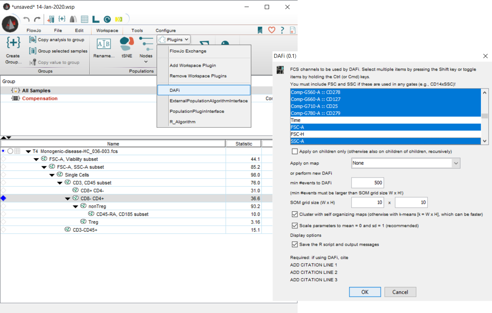
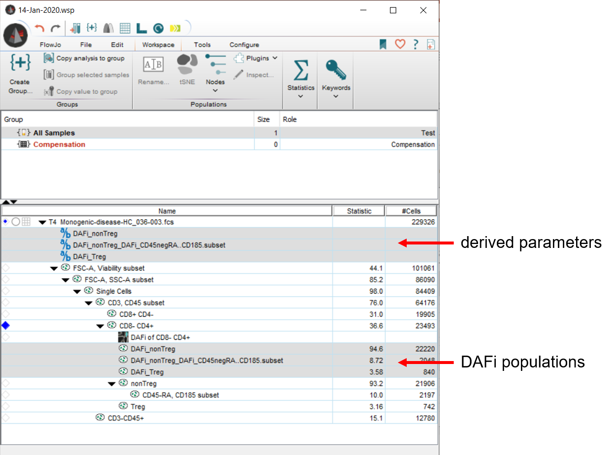

Overview
========

Our new FlowJo plugin for DAFi bridges automated clustering techniques
and human-driven gating strategies. DAFi stands for **D**irected
**A**utomated **F**iltering and **I**dentification of cell populations
in polychromatic flow cytometry data. The major feature of DAFi is its
ability to control unsupervised clustering tools for the identification
of previously known populations of interest in high-dimensional flow
cytometry datasets. Among other many advantages, DAFi-derived gating
results follow a much more natural distribution of the data. For more
details, please see: <https://doi.org/10.1002/cyto.a.23371>.

Obtaining the plugin
====================

On a mac, install
[XCode](https://apps.apple.com/us/app/xcode/id497799835?mt=12) and
[gfortran](https://github.com/fxcoudert/gfortran-for-macOS/releases)
before the next step.

On mac and windows, download the **DAFi.jar** file from our [Google
Drive](https://drive.google.com/drive/folders/1fdTVdbz8S_v58oPX8jpYDudL4wRAge2a)
and copy the file to FlowJo’s plugin folder. More information on how to
install a plugin in FlowJo can be found
[here](http://docs.flowjo.com/d2/plugins/installing-plugins/).

Don’t forget to restart FlowJo before you can use the new plugin.

<!---  (Give it try! Just download the __DAFi.jar__ file above (soon you will also find it on [FlowJo's Plugin page](https://www.flowjo.com/exchange/#/)) and copy the file to your FlowJo plugins folder! Don't forget to restart FlowJo before using a new plugin.) --->
Short Intro
===========

Under the hood, the FlowJo plugin extracts the manual gating strategy
from FlowJo to set the boundaries of regions of interest in the
parameter hyperspace. Then, it gates on learned cluster centroids
located in the regions of interest and finds all cells whose nearest
neighbors are centroids of interest. Finally, the plugin automatically
gates each cell according to their updated identities, returning them to
the FlowJo workspace.

Motivation
----------

With the advent of high dimensional single cell interrogation
technologies, bidimensional manual gating became obsolete. This led to a
quick rise in the number of automatic clustering algorithms for
biological and immunological research but several problems are
associated with automated gating strategies, such as:

-   Combining automated data analysis with human knowledge about
    gene/protein expression levels in specific cell types that perform a
    certain function of interest.
-   Validate the results of automatic clustering.
-   Dealing with batch effects. If manual gating is used, one can
    subjectively (or semi-automatically) shift a gate, but if clustering
    is used, one often finds new “populations”.

DAFi tries to solve some of these problems. The basic idea behind DAFi
is to gate the centroids of clustering results with the manual gating
strategy and update single cell identity according to within which gate
the nearest neighboring centroid is located, if any.

The algorithm works like this:

-   Cluster single cells using a high number of clusters;
-   Gate the cluster centroids using manual gates;
-   Merge clusters if their centroids are inside a given gate;
-   Cells whose nearest neighbors is one of merged clusters belong to
    one merged population.

 **Fig1**: How DAFi aims at bridging manual gating
and automated clustering techniques.

Reported advantages of DAFi
---------------------------

Several advantages of DAFi have been reported (see [original
publication](https://doi.org/10.1002/cyto.a.23371)):

-   Better separation of poorly-resolved populations
-   Abrupt cut in manual gating vs “natural” shape of data distribution
    in DAFi
-   Higher interpretability of automated clustering
-   When used recursively, higher chances of finding smaller populations
    than in automated clustering
-   Effective use of human knowledge in guiding automated algorithms

ezDAFi in action: DAFi from inside Flowjo
-----------------------------------------

Our new implementation of DAFi relies on R and several R packages, in
particular flowWorkspace and FlowSOM, to bring DAFi to FlowJo in the
form of an easy-to-use plugin.

The plugin automatically imports single-cell data and FlowJo-derived
gating strategies into R, builds single cell representations with either
self-organizing maps (SOM, preferable) or k-means, and updates single
cell identities according to the location of their nearest cluster
centroid within the gating tree. The plugin can be used to refine gated
populations in FlowJo, allowing for the visual check and re-use of DAFi
gated cells in downstream analysis, such as building stats and plots.

While building the gating tree, the user can select a parent population,
call the plugin and refine all of its child populations using DAFi.

 **Fig2**: Selecting “Single Cells” and running the
plugin will refine either all gates down the hierarchy from “Single
Cells” or only the immediate children, depending on user input. In this
case, we only show one example of one immediate child gate, the “CD3,
CD45 subset”. Please note how the DAFi-refined population shows a much
more natural distribution of the parameters after gating.

The user can also build the whole gating tree first and then apply DAFi
to a upstream population for the plugin to refine all children and
children of children of that population. This feature allows for DAFi to
be used recursively throughout several levels of the gating tree without
additional human interaction. This way, all sub-populations downstream
of the selected gate will be refined by DAFi.

Conclusion
----------

Our new plugin brings the power of DAFi to FlowJo, the most widely used
single cell flow cytometry data analysis platform. This new
implementation allows for the use of DAFi on the fly, giving the user
the flexibility to re-use DAFi-refined populations with any of FlowJo’s
downstream analysis capabilities.

Notes, Source and How To Use
----------------------------

#### Processing time

-   Depends on the number of centroids to be used
-   First run can take a few minutes to install required R packages
-   Since data are saved to hard disk, it may run slow on some older
    systems

#### Known Bugs

-   DAFi-ing children of DAFi gates does not work. The plugin creates
    derived parameters (zeros and ones), which are used to DAFi-gate
    cells in FlowJo. FlowJo-derived parameters are not imported into
    flowWorkspace in R, such that DAFi gates are not recognized in R for
    DAFi analysis of children of DAFi gates. TODO: make derived
    parameters exportable/readable in R.
-   Every DAFi-gate generates one derived parameter, overpopulating the
    view. TODO: Import derived parameters from R into FlowJo as one
    parameter for each DAFi run.
-   R error messages are not visible to the user. TODO: Make R error
    messages visible to the user

#### Visual Guide With an Example

Population that we will cluster: CD8-CD4+.

Gates that we will refine with DAFi:

-   “nonTreg”
-   “CD45-RA, CD185 subset” among nonTregs
-   “Treg”

After selecting population of interest, click on “Workspace”, “plugins”
and “DAFi”. Select parameters for clustering among other options.

After hitting OK, the plugin runs for a few seconds (about 10-20sec for
default number of clusters; the first run may take a few minutes to
install packages; when running on a Mac for the firs time, the user will
need to instal Xcode and gfortran \[see installation instructions
above\]).

Derived parameters and gated populations are imported back into FlowJo
automatically. Please note how the plugin ran DAFi on the whole tree
down from “CD8-CD4+” (this behavior can be turned off to DAFi only the
immediate children).

DAFi populations behave just like FlowJo native populations! They can be
plotted, gated, used in layouts and stats! Please note, however, that
one cannot call the plugin on a children or children of children of a
previous DAFi gate, yet.

